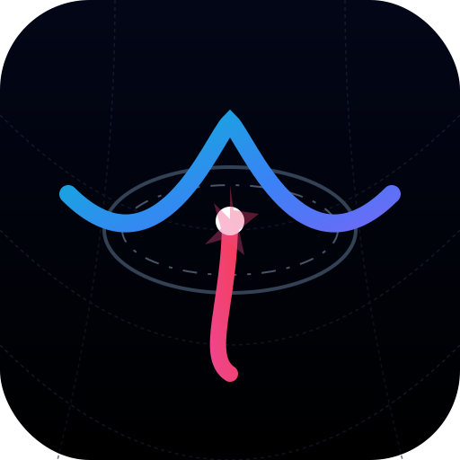

<p align="center">
  
</p>

<h1 align="center">TrackOps</h1>

<p align="center">
  <strong>Control operativo para proyectos de desarrollo con agentes IA.</strong><br/>
  Seguimiento de tareas, docs auto-generados, dashboard local y metodología ETAPA — todo desde un CLI. Cero dependencias externas.
</p>

<p align="center">
  <a href="https://www.npmjs.com/package/trackops"></a>
  <a href="LICENSE"></a>
  <a href="#">= 18" /></a>
  <a href="#"></a>
</p>

<p align="center">
  <a href="#español">Español</a> · <a href="#english">English</a> · <a href="https://baxahaun.github.io/trackops">Web</a>
</p>

---

## Español

### ¿Qué es TrackOps?

TrackOps es una herramienta CLI diseñada para **vibecoders** y desarrolladores que trabajan con agentes IA. Te da una columna vertebral operativa para que tu proyecto no pierda el rumbo:

- **Seguimiento de tareas** — estados, prioridades, fases y dependencias.
- **Docs auto-generados** — `task_plan.md`, `progress.md` y `findings.md` se regeneran en cada `sync`.
- **Dashboard local** — interfaz web para visualizar, crear y gestionar tareas.
- **Portfolio multi-proyecto** — registra y alterna entre proyectos desde el dashboard.
- **Git hooks** — captura automática del estado del repo en cada commit.
- **Metodología ETAPA** — framework opcional de 5 fases con orquestación de agentes IA basada en skills.
- **i18n** — Español (por defecto) e Inglés.

### Inicio Rápido

```bash
npx trackops init               # Inicializar
npx trackops status              # Ver estado del proyecto
npx trackops next                # Cola priorizada de tareas
npx trackops task start T-001    # Empezar una tarea
npx trackops sync                # Regenerar docs
npx trackops dashboard           # Lanzar dashboard web
```

### Instalación

```bash
# Directamente con npx (sin instalar)
npx trackops init

# O instalar globalmente
npm install -g trackops

# O como dependencia de desarrollo
npm install --save-dev trackops
```

### Arquitectura

```
┌─────────────────────────────────────────────────┐
│        Capa 3: Skills (gestionadas)             │
│  trackops skill install / list / remove         │
├─────────────────────────────────────────────────┤
│        Capa 2: ETAPA (opcional)                 │
│  trackops etapa install / configure / status    │
├─────────────────────────────────────────────────┤
│        Capa 1: Motor Ops (siempre)              │
│  tareas · dashboard · registro · git hooks      │
└─────────────────────────────────────────────────┘
```

### Comandos CLI

#### Motor Ops

| Comando | Descripción |
|---------|-------------|
| `trackops init [--with-etapa] [--locale es\|en]` | Inicializar en el directorio actual |
| `trackops status` | Estado: foco, fase, tareas, bloqueadores, repo |
| `trackops next` | Próximas tareas ejecutables |
| `trackops sync` | Regenerar task_plan.md, progress.md, findings.md |
| `trackops dashboard` | Lanzar dashboard web local |
| `trackops task <acción> <id> [nota]` | start, review, complete, block, pending, cancel, note |
| `trackops refresh-repo` | Actualizar runtime con estado del repo |
| `trackops register` | Registrar en el portfolio multi-proyecto |
| `trackops projects` | Listar proyectos registrados |

#### ETAPA (opcional)

| Comando | Descripción |
|---------|-------------|
| `trackops etapa install` | Instalar metodología ETAPA |
| `trackops etapa status` | Estado de instalación e integridad |
| `trackops etapa configure` | Reconfigurar fases o idioma |
| `trackops etapa upgrade` | Actualizar templates a la versión del paquete |

#### Skills

| Comando | Descripción |
|---------|-------------|
| `trackops skill install <nombre>` | Instalar skill del catálogo |
| `trackops skill list` | Listar skills instaladas |
| `trackops skill remove <nombre>` | Desinstalar skill |
| `trackops skill catalog` | Ver skills disponibles |

### Metodología ETAPA

Framework opcional de 5 fases para desarrollo con IA:

| Fase | Nombre | Foco |
|------|--------|------|
| **E** | Estrategia | Visión, datos, reglas de negocio |
| **T** | Tests | Conectividad y validación |
| **A** | Arquitectura | Construcción en 3 capas |
| **P** | Pulido | Refinamiento y calidad |
| **AU** | Automatización | Despliegue y triggers |

Las fases son totalmente configurables por proyecto.

### Estructura del Proyecto

```
mi-proyecto/
├── project_control.json       # Control operativo
├── task_plan.md               # Plan de tareas (auto)
├── progress.md                # Progreso (auto)
├── findings.md                # Hallazgos (auto)
├── genesis.md                 # Constitución (ETAPA)
├── .agent/hub/                # Agent hub (ETAPA)
└── .agents/skills/            # Skills instaladas (ETAPA)
```

### Requisitos

- Node.js >= 18
- Cero dependencias externas

---

## English

### What is TrackOps?

TrackOps is a CLI tool built for **vibecoders** and developers working with AI agents. It gives your project an operational backbone so nothing falls through the cracks:

- **Task tracking** — states, priorities, phases, and dependencies.
- **Auto-generated docs** — `task_plan.md`, `progress.md`, and `findings.md` regenerated on every `sync`.
- **Local dashboard** — web UI to visualize, create, and manage tasks.
- **Multi-project portfolio** — register and switch between projects from the dashboard.
- **Git hooks** — automatic repo state capture on every commit.
- **ETAPA methodology** — optional 5-phase framework with skill-based AI agent orchestration.
- **i18n** — Spanish (default) and English.

### Quick Start

```bash
npx trackops init               # Initialize
npx trackops status              # Check project state
npx trackops next                # Prioritized task queue
npx trackops task start T-001    # Start a task
npx trackops sync                # Regenerate docs
npx trackops dashboard           # Launch web dashboard
```

### Installation

```bash
# Directly with npx (no install needed)
npx trackops init

# Or install globally
npm install -g trackops

# Or as a dev dependency
npm install --save-dev trackops
```

### CLI Commands

#### Ops Engine

| Command | Description |
|---------|-------------|
| `trackops init [--with-etapa] [--locale es\|en]` | Initialize in current directory |
| `trackops status` | State: focus, phase, tasks, blockers, repo |
| `trackops next` | Next executable tasks |
| `trackops sync` | Regenerate task_plan.md, progress.md, findings.md |
| `trackops dashboard` | Launch local web dashboard |
| `trackops task <action> <id> [note]` | start, review, complete, block, pending, cancel, note |
| `trackops refresh-repo` | Update runtime with repo state |
| `trackops register` | Register in multi-project portfolio |
| `trackops projects` | List registered projects |

#### ETAPA (optional)

| Command | Description |
|---------|-------------|
| `trackops etapa install` | Install ETAPA methodology |
| `trackops etapa status` | Installation state and integrity |
| `trackops etapa configure` | Reconfigure phases or locale |
| `trackops etapa upgrade` | Update templates to package version |

#### Skills

| Command | Description |
|---------|-------------|
| `trackops skill install <name>` | Install skill from catalog |
| `trackops skill list` | List installed skills |
| `trackops skill remove <name>` | Uninstall skill |
| `trackops skill catalog` | Show available skills |

### ETAPA Methodology

Optional 5-phase framework for AI-assisted development:

| Phase | Name | Focus |
|-------|------|-------|
| **E** | Strategy | Vision, data, business rules |
| **T** | Tests | Connectivity and validation |
| **A** | Architecture | 3-layer build |
| **P** | Polish | Refinement and quality |
| **AU** | Automation | Deployment and triggers |

Phases are fully configurable per project.

### Requirements

- Node.js >= 18
- Zero external dependencies

---

## Licencia / License

[MIT](LICENSE) — Xavier Crespo Gríman · [Baxahaun AI Venture Studio](https://baxahaun.com)
