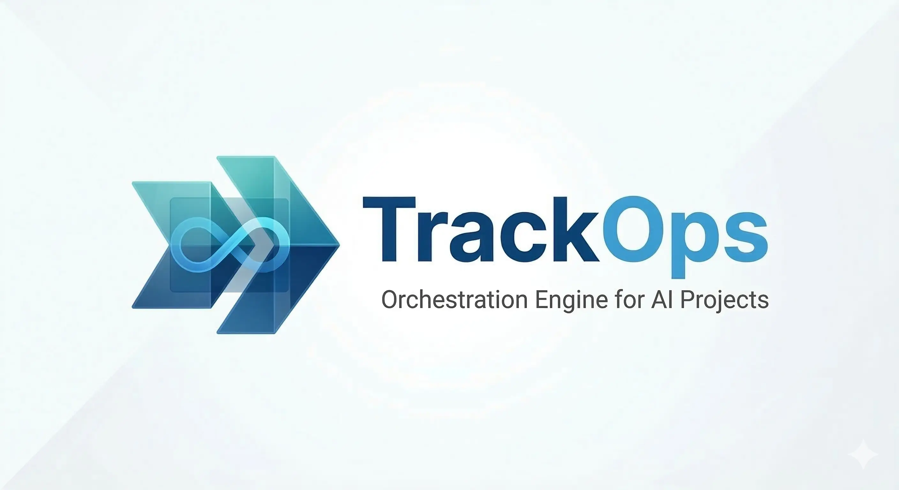

<p align="center">
  
</p>

<h1 align="center">TrackOps</h1>

<p align="center">
  <strong>El motor operativo open-source para desarrolladores que construyen con IA.</strong>
</p>

<p align="center">
  <a href="https://www.npmjs.com/package/trackops"></a>
  <a href="LICENSE"></a>
  
  
</p>

<p align="center">
  <a href="#español">Español</a>&nbsp;&nbsp;·&nbsp;&nbsp;<a href="#english">English</a>&nbsp;&nbsp;·&nbsp;&nbsp;<a href="https://baxahaun.github.io/trackops">Web</a>
</p>

<br/>

---

## Español

### El Problema: La IA es rápida. El caos también.

Escribir código con asistentes de IA (Cursor, Copilot, Claude Code, agentes autónomos) es increíblemente rápido. Pero a medida que el proyecto crece, **la IA pierde el contexto**, olvida las prioridades y el proyecto se convierte en una pesadilla de mantenimiento.

Tu agente no sabe qué tarea es prioritaria. No sabe qué está bloqueado. No sabe en qué fase estás. Y tú terminas repitiendo instrucciones en cada prompt.

### La Solución: TrackOps

TrackOps es un **motor operativo local de código abierto** que actúa como puente entre tú (el humano) y tus agentes de IA.

**Tú** gestionas el proyecto visualmente a través de un elegante **Dashboard Web local**. TrackOps compila automáticamente ese estado en **archivos Markdown hiper-estructurados** (`task_plan.md`, `progress.md`, `findings.md`) que tu IA lee para saber exactamente qué hacer, qué reglas seguir y qué prioridades existen.

> **La IA se encarga del código. TrackOps se encarga del proyecto.**

<br/>

### Por qué TrackOps se volverá indispensable en tu flujo

| | |
|---|---|
| **Adopción en 10 segundos** | Un solo comando: `npx trackops init`. Cero configuración, cero dependencias, cero bases de datos. |
| **Contexto determinista** | No dejes que la IA adivine. TrackOps sincroniza la verdad absoluta de tu proyecto en archivos Markdown que las IAs entienden nativamente. |
| **Dashboard local premium** | Interfaz web profesional que corre en tu terminal. Sin telemetría, sin nube, **100% privado**. |
| **Integración Git nativa** | TrackOps sabe cuándo haces commit, merge o checkout, capturando la salud del repositorio de forma automática. |
| **Portfolio multi-proyecto** | Registra todos tus proyectos y navega entre ellos desde un solo dashboard. |
| **Framework ETAPA** | Metodología de desarrollo con agentes IA en 5 fases: Estrategia, Tests, Arquitectura, Pulido, Automatización. |
| **Ecosistema de Skills** | Plugins modulares que dotan a tu proyecto de capacidades automatizadas: `trackops skill install <nombre>`. |

<br/>

### Inicio Rápido

No necesitas instalar nada globalmente. Ve a cualquier proyecto y ejecuta:

```bash
npx trackops init               # Inicializa el motor en tu proyecto
npx trackops dashboard           # Levanta el centro de control web
```

El flujo desde consola en tu día a día:

```bash
npx trackops status              # Salud del proyecto y bloqueos
npx trackops next                # Siguiente tarea priorizada
npx trackops task start T-001    # Empieza a trabajar
npx trackops sync                # Genera contexto Markdown para tu IA
```

<br/>

### Arquitectura de 3 Capas

Diseñado para escalar desde un script de fin de semana hasta infraestructura empresarial.

```
┌─────────────────────────────────────────────────────┐
│  Capa 3 · Ecosistema de Skills                      │
│  Plugins modulares para automatizar capacidades     │
│  trackops skill install / list / remove / catalog   │
├─────────────────────────────────────────────────────┤
│  Capa 2 · Framework ETAPA (opcional)                │
│  Enrutamiento de agentes y metodología estructurada │
│  trackops etapa install / configure / status        │
├─────────────────────────────────────────────────────┤
│  Capa 1 · Motor Core (siempre activo)               │
│  CLI + Servidor Web Local + Generador de Markdown   │
│  tareas · dashboard · registro · git hooks · sync   │
└─────────────────────────────────────────────────────┘
```

<br/>

### Metodología ETAPA

Framework opcional de 5 fases para desarrollo estructurado con IA. Cada fase tiene un **Definition of Done** verificable:

| Fase | Nombre | Foco | Entregable |
|------|--------|------|------------|
| **E** | Estrategia | Visión, datos, reglas de negocio | Schema JSON en `genesis.md` |
| **T** | Tests | Conectividad y validación | Scripts de test pasando |
| **A** | Arquitectura | Construcción en 3 capas | SOPs + tools + integración |
| **P** | Pulido | Refinamiento y calidad | Outputs validados |
| **AU** | Automatización | Despliegue y triggers | Triggers + smoke test |

Las fases son totalmente configurables por proyecto vía `project_control.json`.

<br/>

### Referencia de Comandos

<details>
<summary><strong>Motor Core</strong></summary>

| Comando | Descripción |
|---------|-------------|
| `trackops init [--with-etapa] [--locale es\|en]` | Inicializar en el directorio actual |
| `trackops status` | Estado: foco, fase, tareas, bloqueadores, repo |
| `trackops next` | Próximas tareas ejecutables priorizadas |
| `trackops sync` | Regenerar task_plan.md, progress.md, findings.md |
| `trackops dashboard` | Lanzar dashboard web local |
| `trackops task <acción> <id> [nota]` | start, review, complete, block, pending, cancel, note |
| `trackops refresh-repo [--quiet]` | Actualizar runtime con estado del repo |
| `trackops register` | Registrar en el portfolio multi-proyecto |
| `trackops projects` | Listar proyectos registrados |

</details>

<details>
<summary><strong>ETAPA</strong></summary>

| Comando | Descripción |
|---------|-------------|
| `trackops etapa install` | Instalar metodología ETAPA |
| `trackops etapa status` | Estado de instalación e integridad |
| `trackops etapa configure [--phases '...']` | Reconfigurar fases o idioma |
| `trackops etapa upgrade` | Actualizar templates a la versión del paquete |

</details>

<details>
<summary><strong>Skills</strong></summary>

| Comando | Descripción |
|---------|-------------|
| `trackops skill install <nombre>` | Instalar skill del catálogo |
| `trackops skill list` | Listar skills instaladas |
| `trackops skill remove <nombre>` | Desinstalar skill |
| `trackops skill catalog` | Ver skills disponibles |

</details>

<br/>

### Estructura del Proyecto

```
mi-proyecto/
├── project_control.json       # Fuente de verdad operativa
├── task_plan.md               # Plan de tareas (auto-generado)
├── progress.md                # Diario de progreso (auto-generado)
├── findings.md                # Hallazgos (auto-generado)
├── genesis.md                 # Constitución del proyecto (ETAPA)
├── .agent/hub/                # Identidad del agente + router (ETAPA)
└── .agents/skills/            # Skills instaladas (ETAPA)
```

<br/>

### Apoya el Proyecto

TrackOps es y siempre será **libre, gratuito y de código abierto** (MIT). Construimos esto para resolver un problema real de la comunidad de desarrolladores.

Si TrackOps te ha ayudado a recuperar el control de tus proyectos con IA:

1. **Dale una estrella en GitHub** — ayuda enormemente a la visibilidad.
2. **Comparte TrackOps** con tu equipo y en tus redes.
3. **Contribuye** — Pull Requests, reporte de bugs y nuevas Skills son siempre bienvenidos.

<br/>

---

## English

### The Problem: AI is fast. So is chaos.

Writing code with AI assistants (Cursor, Copilot, Claude Code, autonomous agents) is incredibly fast. But as the project grows, **the AI loses context**, forgets priorities, and the project becomes a maintenance nightmare.

Your agent doesn't know which task is a priority. It doesn't know what's blocked. It doesn't know what phase you're in. And you end up repeating instructions in every prompt.

### The Solution: TrackOps

TrackOps is a **local, open-source operational engine** that acts as a bridge between you (the human) and your AI agents.

**You** manage the project visually through an elegant **local Web Dashboard**. TrackOps automatically compiles that state into **hyper-structured Markdown files** (`task_plan.md`, `progress.md`, `findings.md`) that your AI reads to know exactly what to do, what rules to follow, and what priorities exist.

> **AI handles the code. TrackOps handles the project.**

<br/>

### Why TrackOps will become essential in your workflow

| | |
|---|---|
| **10-second adoption** | One command: `npx trackops init`. Zero config, zero dependencies, zero databases. |
| **Deterministic context** | Don't let AI guess. TrackOps syncs the absolute truth of your project into Markdown files that AIs understand natively. |
| **Premium local dashboard** | Professional web interface running in your terminal. No telemetry, no cloud, **100% private**. |
| **Native Git integration** | TrackOps knows when you commit, merge, or checkout, capturing repository health automatically. |
| **Multi-project portfolio** | Register all your projects and navigate between them from a single dashboard. |
| **ETAPA Framework** | AI development methodology in 5 phases: Strategy, Tests, Architecture, Polish, Automation. |
| **Skills ecosystem** | Modular plugins that give your project automated capabilities: `trackops skill install <name>`. |

<br/>

### Quick Start

No global install needed. Go to any project and run:

```bash
npx trackops init               # Initialize the engine in your project
npx trackops dashboard           # Launch the web control center
```

Your daily workflow from the console:

```bash
npx trackops status              # Project health and blockers
npx trackops next                # Next prioritized task
npx trackops task start T-001    # Start working
npx trackops sync                # Generate Markdown context for your AI
```

<br/>

### 3-Layer Architecture

Designed to scale from a weekend script to enterprise infrastructure.

```
┌─────────────────────────────────────────────────────┐
│  Layer 3 · Skills Ecosystem                         │
│  Modular plugins for automated capabilities         │
│  trackops skill install / list / remove / catalog   │
├─────────────────────────────────────────────────────┤
│  Layer 2 · ETAPA Framework (optional)               │
│  Agent routing and structured methodology           │
│  trackops etapa install / configure / status        │
├─────────────────────────────────────────────────────┤
│  Layer 1 · Core Engine (always active)              │
│  CLI + Local Web Server + Markdown Generator        │
│  tasks · dashboard · registry · git hooks · sync    │
└─────────────────────────────────────────────────────┘
```

<br/>

### ETAPA Methodology

Optional 5-phase framework for structured AI-assisted development. Each phase has a verifiable **Definition of Done**:

| Phase | Name | Focus | Deliverable |
|-------|------|-------|-------------|
| **E** | Strategy | Vision, data, business rules | JSON schema in `genesis.md` |
| **T** | Tests | Connectivity and validation | Passing test scripts |
| **A** | Architecture | 3-layer build | SOPs + tools + integration |
| **P** | Polish | Refinement and quality | Validated outputs |
| **AU** | Automation | Deployment and triggers | Triggers + smoke test |

Phases are fully configurable per project via `project_control.json`.

<br/>

### Command Reference

<details>
<summary><strong>Core Engine</strong></summary>

| Command | Description |
|---------|-------------|
| `trackops init [--with-etapa] [--locale es\|en]` | Initialize in current directory |
| `trackops status` | State: focus, phase, tasks, blockers, repo |
| `trackops next` | Next prioritized executable tasks |
| `trackops sync` | Regenerate task_plan.md, progress.md, findings.md |
| `trackops dashboard` | Launch local web dashboard |
| `trackops task <action> <id> [note]` | start, review, complete, block, pending, cancel, note |
| `trackops refresh-repo [--quiet]` | Update runtime with repo state |
| `trackops register` | Register in multi-project portfolio |
| `trackops projects` | List registered projects |

</details>

<details>
<summary><strong>ETAPA</strong></summary>

| Command | Description |
|---------|-------------|
| `trackops etapa install` | Install ETAPA methodology |
| `trackops etapa status` | Installation state and integrity |
| `trackops etapa configure [--phases '...']` | Reconfigure phases or locale |
| `trackops etapa upgrade` | Update templates to package version |

</details>

<details>
<summary><strong>Skills</strong></summary>

| Command | Description |
|---------|-------------|
| `trackops skill install <name>` | Install skill from catalog |
| `trackops skill list` | List installed skills |
| `trackops skill remove <name>` | Uninstall skill |
| `trackops skill catalog` | Show available skills |

</details>

<br/>

### Project Structure

```
my-project/
├── project_control.json       # Operational source of truth
├── task_plan.md               # Task plan (auto-generated)
├── progress.md                # Progress log (auto-generated)
├── findings.md                # Findings library (auto-generated)
├── genesis.md                 # Project constitution (ETAPA)
├── .agent/hub/                # Agent identity + router (ETAPA)
└── .agents/skills/            # Installed skills (ETAPA)
```

<br/>

### Support the Project

TrackOps is and will always be **free and open-source** (MIT). We built this to solve a real problem in the developer community.

If TrackOps has helped you regain control of your AI-assisted projects:

1. **Star us on GitHub** — it helps enormously with visibility.
2. **Share TrackOps** with your team and on social media.
3. **Contribute** — Pull Requests, bug reports, and new Skills are always welcome.

<br/>

---

<p align="center">
  <a href="https://baxahaun.com"><strong>Xavier Crespo Gríman</strong></a> · <a href="https://baxahaun.com">Baxahaun AI Venture Studio</a>
  <br/>
  <a href="LICENSE">MIT License</a> · 2026
</p>
