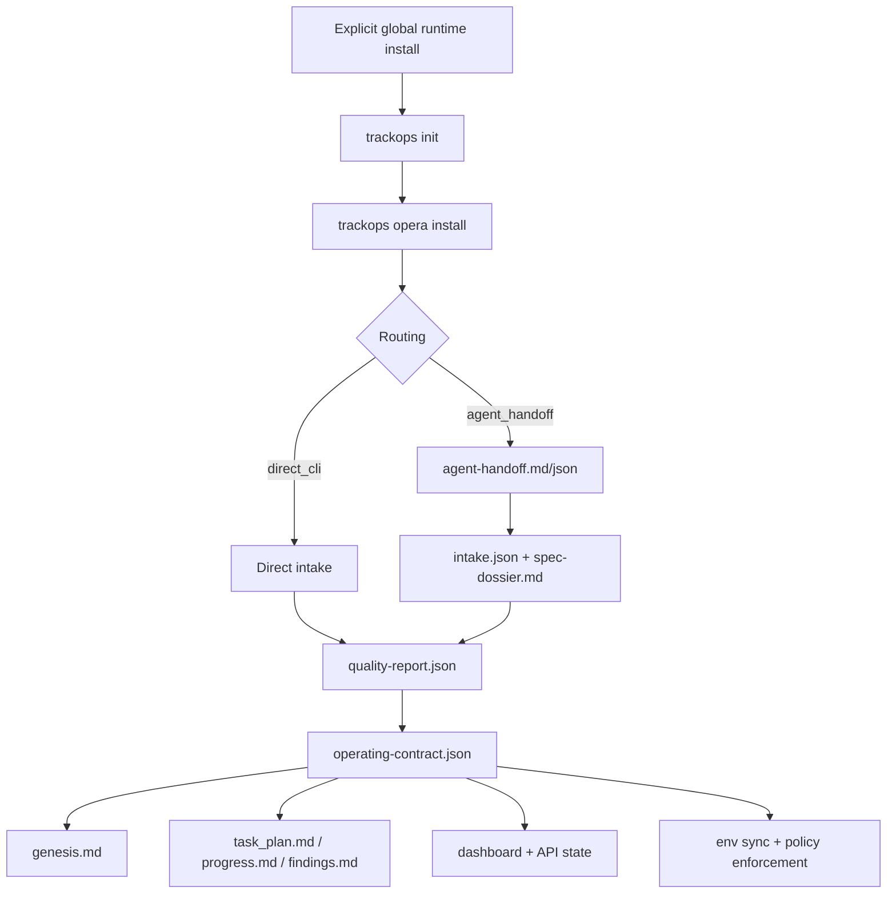

# Dependency Graph

## Notes

- `ops/project_control.json` is the operational source of truth for backlog and session state.
- `ops/contract/operating-contract.json` is the machine contract.
- `ops/genesis.md` is a compiled human view.
